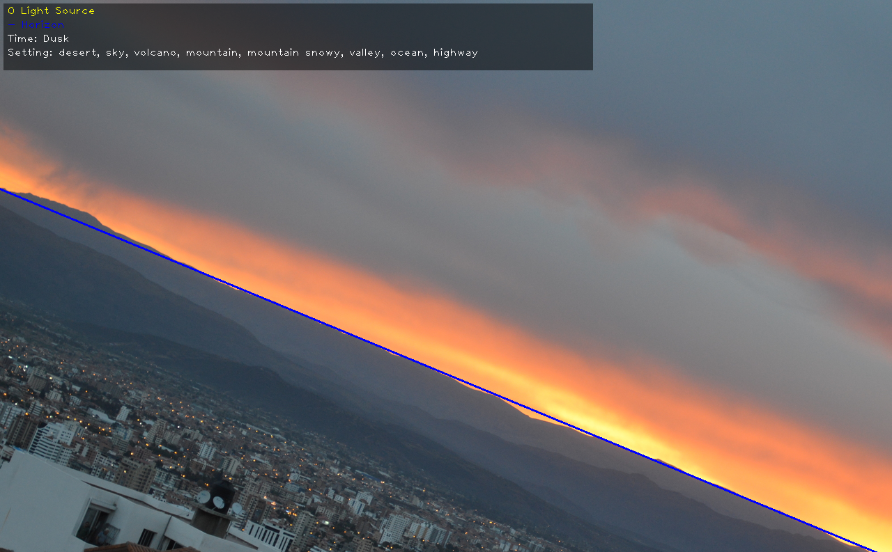

# Landscape Identifier

Uses image processing manipulations from OpenCV and image classification from Caffe models to:
- Identify the source of light
- Detect the horizon of the image
- Describe the time of day
- Identify the setting

## Results

Here are some outputs with impressive results.

## OpenCV

The version used was `3.4.1` 

To install it follow the instructions at [OpenCV-Python](https://pypi.org/project/opencv-python/)

## Caffe Model
The model used was [CNDS on Scene Recognition](https://github.com/BVLC/caffe/wiki/Model-Zoo#places_cnds_models-on-scene-recognition) by L.Wang, C.Lee, Z.Tu, S. Lazebnik. You can see their report [here](http://arxiv.org/pdf/1505.02496.pdf).

Download the `8conv3fc_DSN.caffemodel` file [here](https://drive.google.com/file/d/0B_s0NuQ5DMW_SUZCOUV2amY3ZkU/view?usp=sharing).

Download the `deploy.prototext` file [here](https://raw.githubusercontent.com/lwwang/Places_CNDS_model/master/deploy.prototxt).

Download the labels file [here](http://places.csail.mit.edu/IndoorOutdoor_places205.csv).
